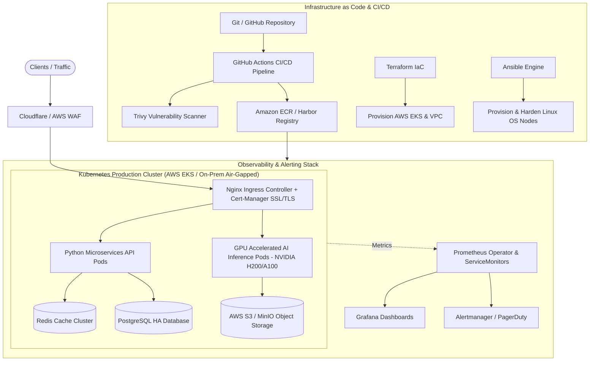

# 🏗️ Enterprise Production DevOps & Cloud Architecture Platform

A production-grade, enterprise-scale **Cloud-Native & Hybrid DevOps Architecture** designed for high availability, zero-downtime deployments, multi-tenant isolation, and GPU-accelerated AI/ML workload orchestration.

---

## 📐 High-Level Architecture Overview



---

## 🛠️ Architecture Stack & Core Components

| Component | Technology | Purpose & Capabilities |
|---|---|---|
| **Orchestration** | Kubernetes (K8s), Helm, HPA | Container lifecycle management, zero-downtime RollingUpdates, auto-scaling |
| **GPU/AI Platform** | NVIDIA GPU Operator, MIG | Fractional GPU scheduling, CUDA isolation for AI workloads |
| **Infrastructure as Code** | Terraform | AWS Multi-AZ VPC, EKS Cluster, ECR, IAM Roles for Service Accounts (IRSA) |
| **Configuration Management**| Ansible | Automated Linux server provisioning, kernel hardening, Security compliance |
| **CI/CD Pipeline** | GitHub Actions, Trivy | Automated build, container security scanning, Helm release deployments |
| **Traffic & Security** | Nginx Ingress, Cert-Manager | TLS/SSL termination, rate limiting, RBAC, network isolation |
| **Observability** | Prometheus, Grafana | Metric scraping via ServiceMonitors, real-time alert triggers |

---

## 📂 Repository Structure

```text
.
├── .github/workflows/
│   └── production-pipeline.yml     # CI/CD Workflow for Security Scan & Helm Deploy
├── ansible/
│   ├── site.yml                     # Main Ansible Provisioning Playbook
│   └── roles/
│       └── k8s_setup/
│           └── tasks/main.yml       # Linux Node Hardening & Containerd Setup
├── terraform/
│   ├── main.tf                      # Production AWS EKS & VPC Module
│   └── variables.tf                 # Terraform Variable Definitions
├── k8s/
│   ├── 01-rbac-namespaces.yaml      # Multi-tenant RBAC & Namespace Isolation
│   ├── 02-gpu-ai-workloads.yaml     # NVIDIA GPU Workload Scheduling & Limits
│   ├── 03-ingress-tls.yaml          # Nginx Ingress & Cert-Manager Let's Encrypt
│   └── 04-hpa-autoscaling.yaml      # Horizontal Pod Autoscaling Rules
└── README.md                        # Enterprise Architecture Documentation
```
